## 说明

    一个开发工具集

## 功能模块
```
Hash 值计算 ( MD5 / SHA1 / SHA3 / SHA256 / SHA512 / SHA224 / SHA384 / RipeMD-160 )   
Base64 编码 / 解码
URL 编码 / 解码
时间戳转换
CSS 配色
颜色格式转换
进制转换 ( BIN / OCT / DEC / HEX )
二维码生成   
HmacHash 值计算 ( HmacMD5 / HmacSHA1 / HmacSHA3 / HmacSHA256 / HmacSHA512 / HmacSHA224 / HmacSHA384 / HmacRipeMD-160 )     
SQL 格式化
行数统计
Unicode 编码 / 解码
DES 加密 / 解密   
AES 加密 / 解密    
Rabbit 加密 / 解密    
RC4 加密 / 解密    
3DES 加密 / 解密   
TEA 加密 / 解密   
XTEA 加密 / 解密    
XXTEA 加密 / 解密   
Base58 编码 / 解码
PBKDF2 值计算 
Base64 图片  
GPS坐标转换   
人民币大写   
字节转换
中文拼音
温度转换
距离转换
速度转换
配置文件转换 (ini / json / yaml / toml / properties)
面积转换
容积转换
质量转换

-- 待开发 ------------------
图片主题色 ( 还需要做近似颜色合并处理 )
繁简汉字转换   
RSA 加密 / 解密   
BaseX 编码 / 解码(存在问题)
CRC 计算
JSON 格式化
正则表达式
CRON表达式
密码管理
BCD码
WebSocket 调试

```

## 技术栈
```
Tauri 2            -> 桌面应用框架 (替代原 Electron)
React 18           -> 前端 UI (代码结构保持不变, 位于 src/renderer)
Ant Design 5       -> UI 组件库
webpack 5          -> 渲染进程构建
just               -> 显示使用帮助 (默认命令)
Rust               -> Tauri 主进程 (位于 src-tauri)
```

## 项目结构
```
magic-tools
├── src-tauri/                  # Tauri 2 主进程 (Rust)
│   ├── src/main.rs             # 入口
│   ├── src/lib.rs              # 窗口/托盘/打开链接等逻辑
│   ├── tauri.conf.json         # Tauri 配置 (窗口大小、打包、图标)
│   ├── capabilities/           # 权限配置
│   └── icons/                  # 应用图标
├── src/renderer/               # React 前端 (保持不变)
├── .erb/configs/               # webpack 渲染进程构建配置
├── dist/                       # React 打包产物 (Tauri frontendDist)
└── justfile                    # 构建/打包/发布脚本
```

## 开发 & 运行
```
# 前置依赖
#   1. Node.js 18+  (https://nodejs.org)
#   2. Rust        (https://rustup.rs)  
#   3. just        (https://github.com/casey/just)  
#      Windows: winget install casey.just
#      macOS:   brew install just

# 初始化项目

    git clone https://github.com/freewu/magic-tools.git
    cd magic-tools
    npm install

# 开发模式 (webpack dev server + Tauri 窗口)

    just dev
    # 或: npm run dev

# 只启动 React 开发服务器 (浏览器调试)

    just dev-renderer

# 打包应用 (输出到 src-tauri/target/release/bundle/)

    just build
    # 或: npm run build

# 指定打包目标

    just bundle nsis      # Windows 安装包
    just bundle appimage  # Linux AppImage
    just bundle dmg       # macOS 安装包

# 打包并复制到 release/ 目录 (方便手动分发, 产物在项目根目录 release/ 下)
# 默认生成单体免安装 exe (直接双击运行, 需要系统自带 WebView2)

    just release              # 打包单体免安装 exe 并复制到 release/
    just release nsis         # 指定打包格式 (nsis 安装包等) 并复制

# 生成应用图标 (从 assets/logo.png 生成到 src-tauri/icons/)
# 注意: 需先将方形 1024x1024 PNG 放到 assets/logo.png, 再运行此命令

    just icon

# 发布到 GitHub Releases (需要 gh CLI: gh auth login)
# 默认按 package.json 版本发布, 可用 VERSION 环境变量覆盖:
#   VERSION=1.3.1 just publish

    just publish

# 其他

    just lint     # 代码检查
    just test     # 单元测试
    just clean    # 清理构建产物
    just doctor   # 检查 Tauri 环境
```

## 组件

<a target="_blank" href="https://tauri.app/">Tauri 2</a>   
<a target="_blank" href="https://react.dev/">React 18</a>   
<a target="_blank" href="https://ant.design/">Ant Design 5</a>  
<a target="_blank" href="https://github.com/brix/crypto-js">CryptoJS</a>  
<a target="_blank" href="https://github.com/dankogai/js-base64">js-base64</a>   
<a target="_blank" href="https://github.com/Qix-/color-convert">color-convert</a>   
<a target="_blank" href="https://github.com/sql-formatter-org/sql-formatter">SQL Formatter</a>   
<a target="_blank" href="https://highlightjs.org/">highlight.js</a>    
<a target="_blank" href="https://github.com/cryptocoinjs/base-x">base-x</a>   
<a target="_blank" href="https://pinyin-pro.cn/">pinyin-pro</a>   
<a target="_blank" href="https://github.com/Sdju/js-ini">js-ini</a>   
<a target="_blank" href="https://github.com/eemeli/yaml">yaml</a>   
<a target="_blank" href="https://github.com/timhall/toml-patch">toml-patch</a>   
<a target="_blank" href="https://github.com/TehShrike/deepmerge">deepmerge</a>   

## 应用截图
* Hash 值计算
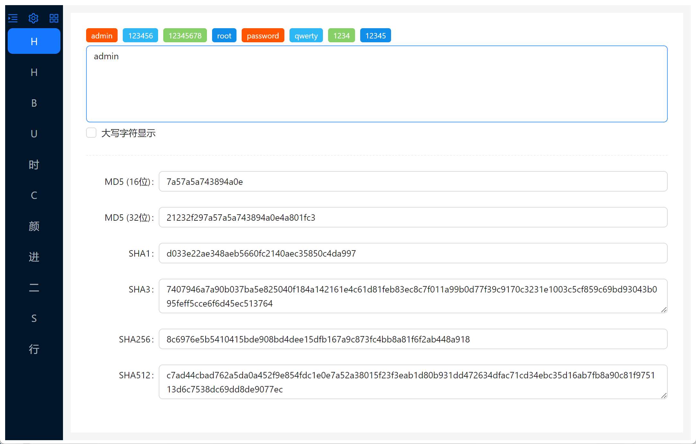
* Base64 编解码
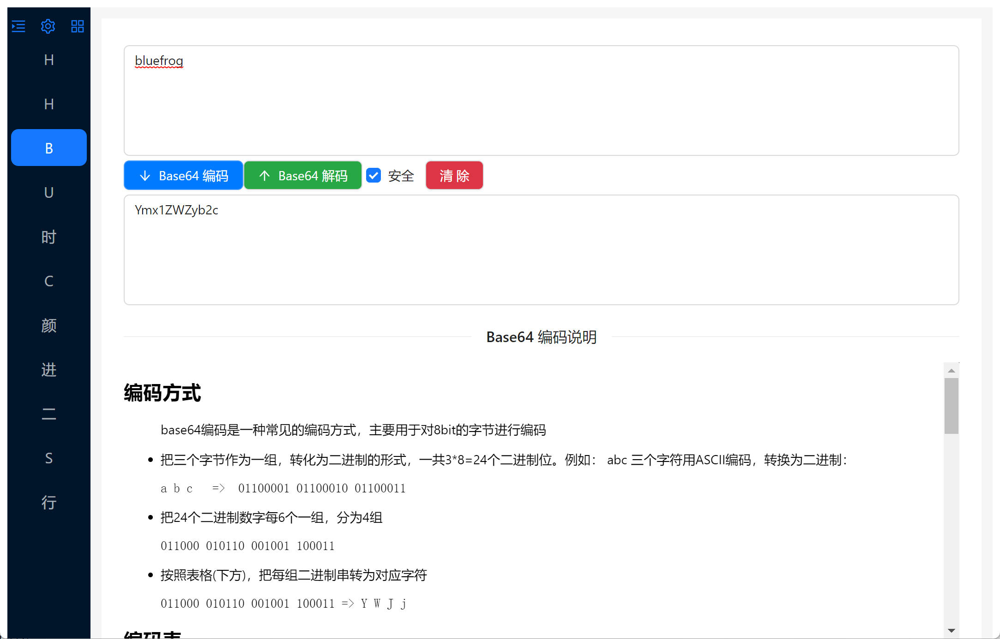
* URL 编解码
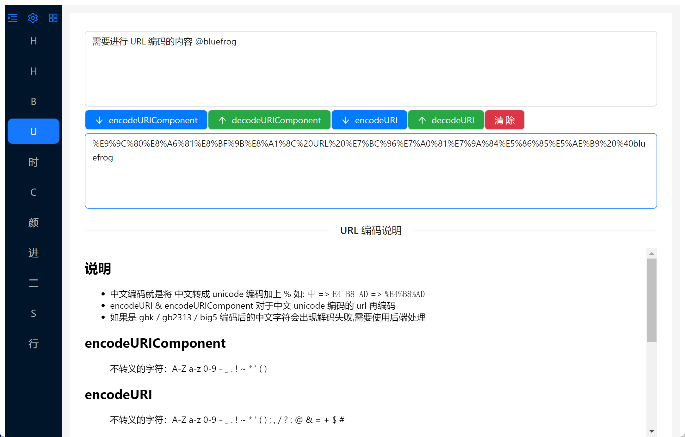
* 时间戳转换
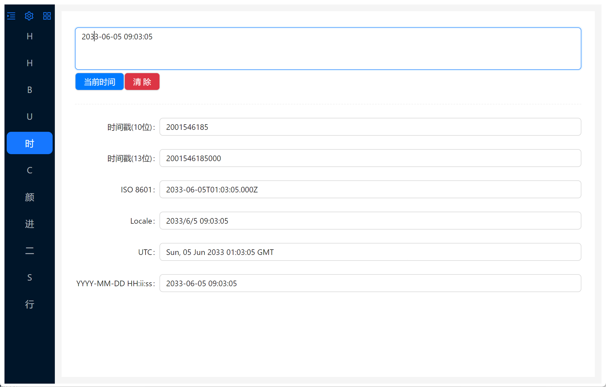
* CSS 配色
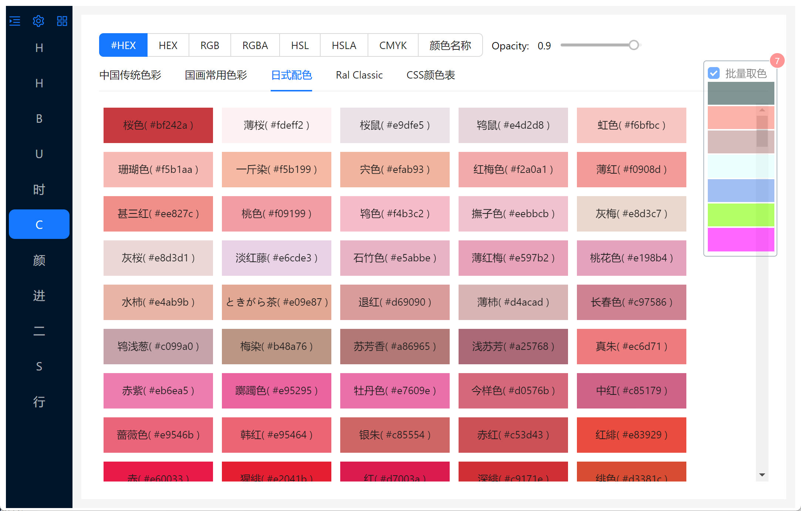
* 颜色格式转换
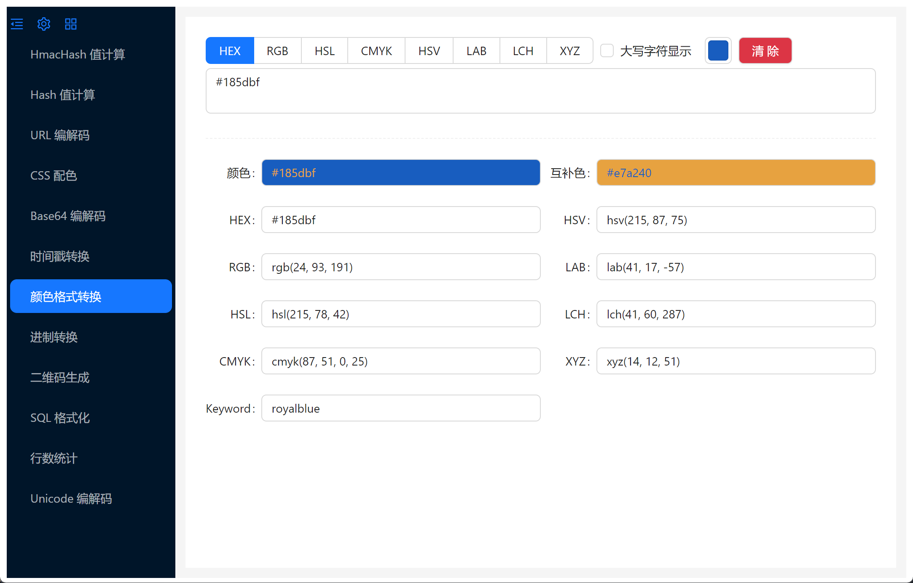
* 进制转换
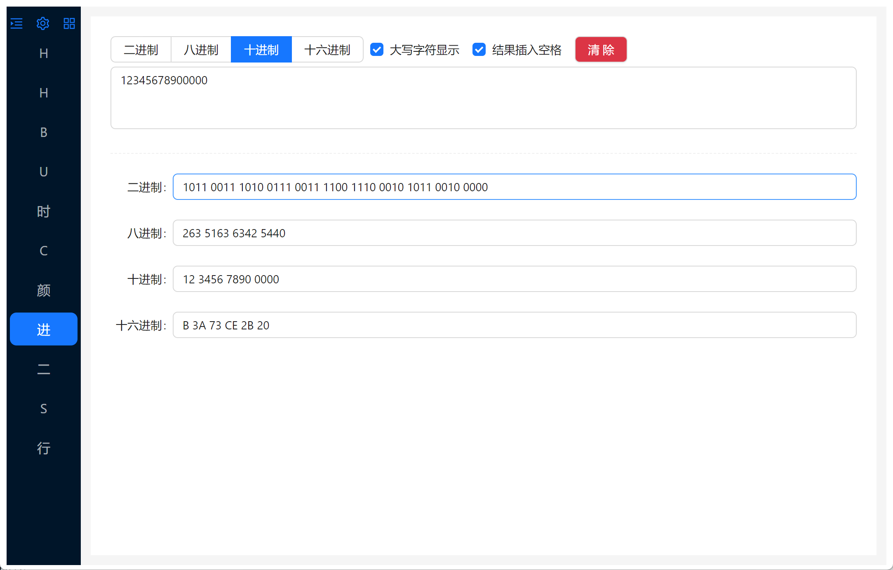
* HmacHash 值计算
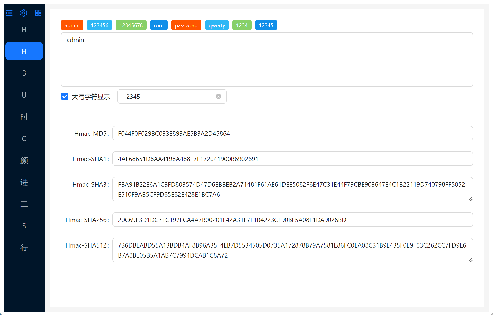
* SQL 格式化
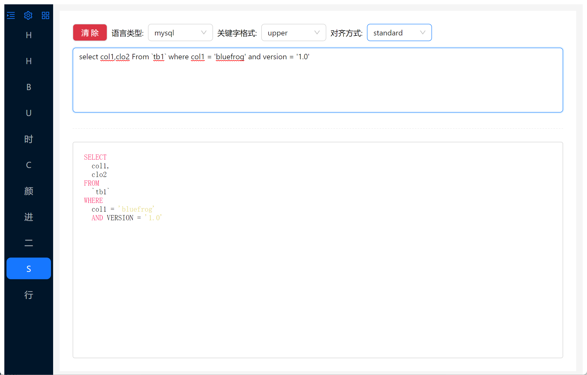
* 行数统计
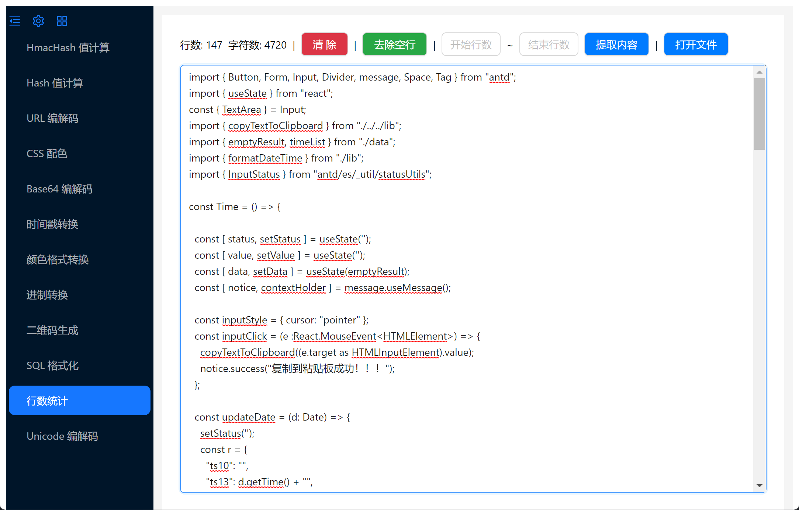
* Unicode 编解码
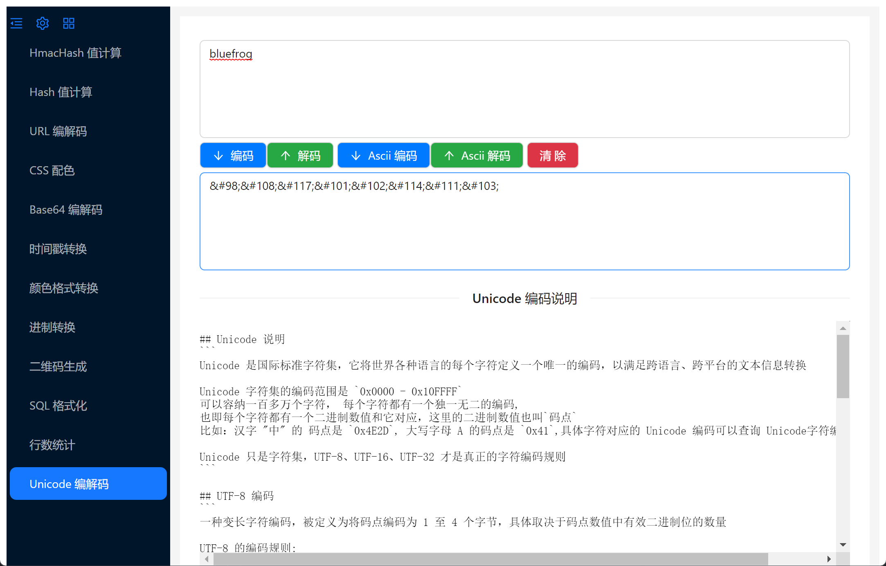

## Q&A
```
## tauri 构建太慢 / 首次编译时间长

    Rust 首次编译需要下载并编译全部依赖, 属正常现象。
    后续增量编译会快很多。可执行 just doctor 检查环境。

## 打开外部链接 (GPS 坐标转换中的地图链接)

    Tauri 环境使用 @tauri-apps/plugin-opener 调用系统默认浏览器;
    纯浏览器调试环境自动回退到 <a target="_blank"> 方式。

## 自动更新

    原 Electron 版本使用 electron-updater (GitHub Provider)。
    Tauri 2 对应 tauri-plugin-updater:
        1. cargo add tauri-plugin-updater
        2. 生成签名密钥: npm run tauri signer generate
        3. 在 src-tauri/tauri.conf.json 的 plugins.updater 配置 pubkey 与 endpoints
        4. 在 src-tauri/src/lib.rs 注册插件
        详见 https://tauri.app/plugin/updater/

## 窗口关闭行为

    点击窗口关闭按钮会隐藏到系统托盘 (与 Electron 版本一致),
    在托盘右键菜单选择「退出」才会真正退出应用。
```

## 版本修改 (发布前需要修改)
```
./package.json          # 主版本号
./src-tauri/Cargo.toml  # Rust 包版本号 (需与 package.json 一致)
./src-tauri/tauri.conf.json  # bundle 版本号
```
## 开发规范

### 规则 1: 每次开发完成提交并推送

每次完成一个开发任务后，总结本次改动作为 git message 提交，并推送到远程：

    just commit "feat: 新增 XX 功能"
    # 等价于: git add -A && git commit -m "<总结>" && git push

### 规则 2: 版本发布流程

修改版本号发布新版本时：

1. 同步版本号: `package.json` / `src-tauri/Cargo.toml` / `src-tauri/tauri.conf.json`
2. 在 `update.md` 中总结本次版本的更新内容 (将作为 GitHub Release 的发布说明)
3. 打 tag 并推送，自动触发 GitHub Actions 打包三平台免安装包:

    just tag 1.3.1
    # 等价于: git add -A && git commit -m "chore: release v1.3.1"
    #          && git tag v1.3.1 && git push && git push origin v1.3.1

4. GitHub Actions (`.github/workflows/build-release.yml`) 自动:
   - Windows: 单体免安装 exe (`--no-bundle`)
   - macOS: 免安装 .app 打包为 zip
   - Linux: 免安装 AppImage
   - 用 `update.md` 作为 Release 说明，产物上传到 GitHub Releases
