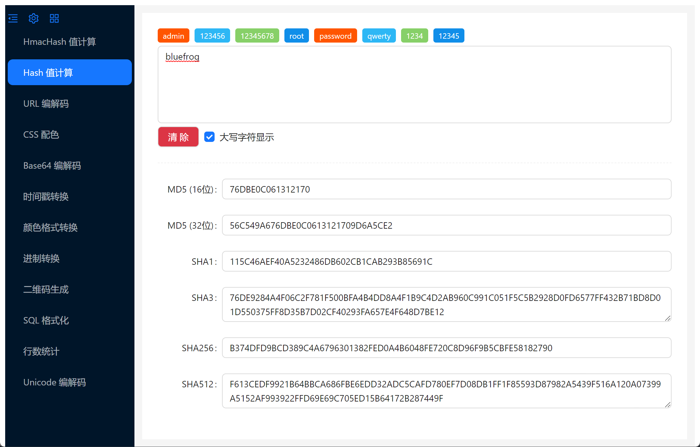
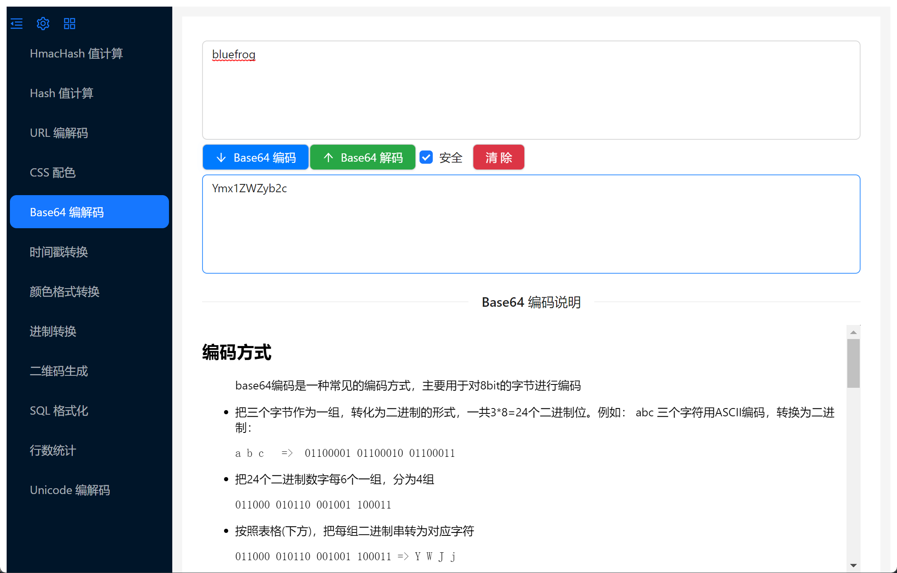
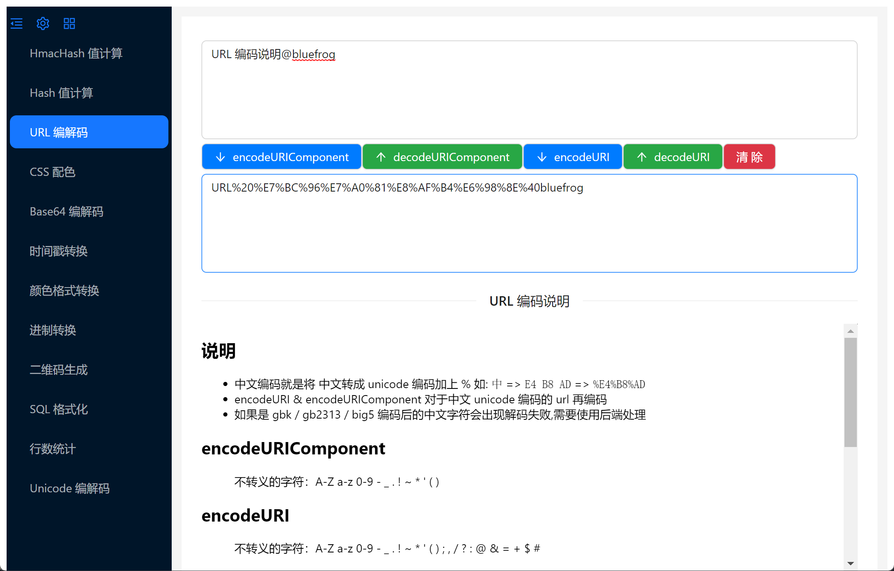
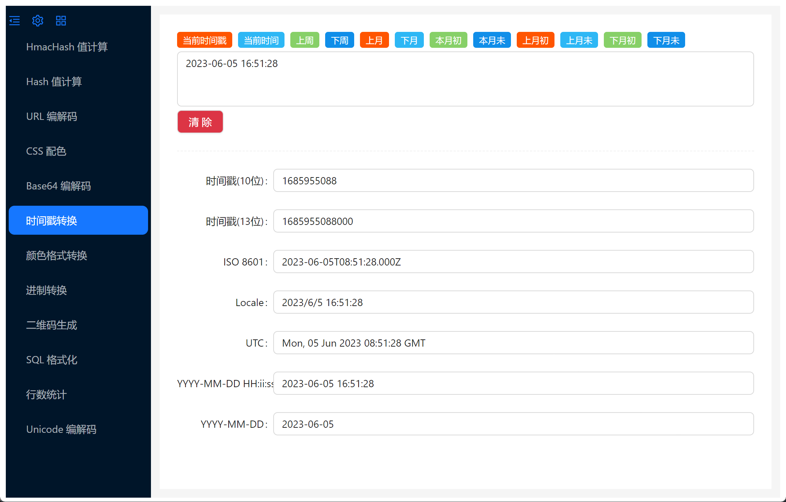
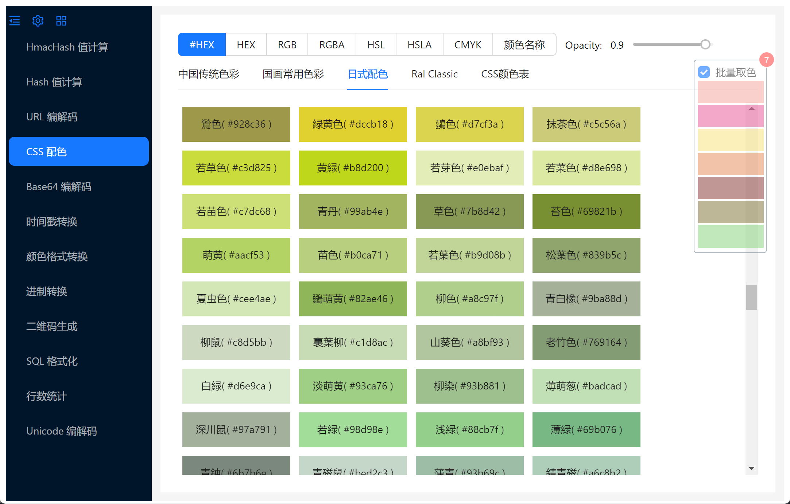
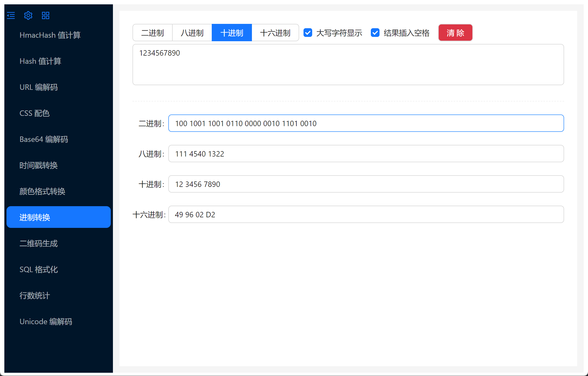
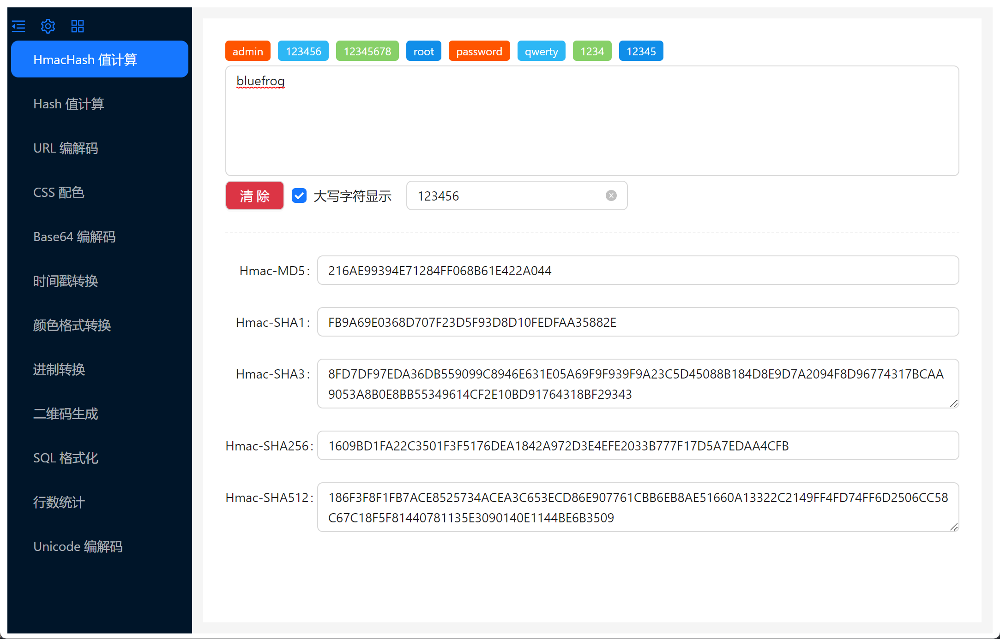
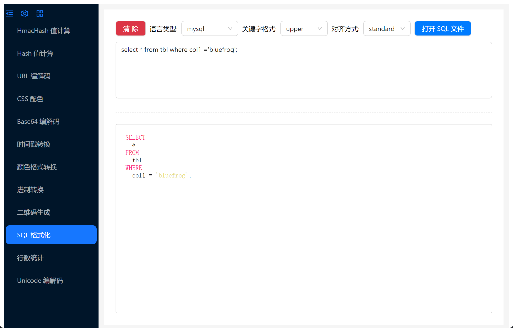

## 说明

    一个开发工具集

## 功能模块
```
Hash 值计算 ( MD5 / SHA1 / SHA3 / SHA256 / SHA512 / SHA224 / SHA384 / RipeMD-160 )   
Base64 编码 / 解码
URL 编码 / 解码
时间戳转换
CSS 配色
颜色格式转换
进制转换 ( BIN / OCT / DEC / HEX )
二维码生成   
HmacHash 值计算 ( HmacMD5 / HmacSHA1 / HmacSHA3 / HmacSHA256 / HmacSHA512 / HmacSHA224 / HmacSHA384 / HmacRipeMD-160 )     
SQL 格式化
行数统计
Unicode 编码 / 解码
DES 加密 / 解密   
AES 加密 / 解密    
Rabbit 加密 / 解密    
RC4 加密 / 解密    

-- 待开发 ------------------
PBKDF2 值计算
3DES 加密 / 解密
CRC 计算
JSON 格式化
正则表达式
CRON表达式
密码管理
BCD码
WebSocket 调试

```

## 开发 & 运行
```
# 初始化项目

    git clone https://github.com/freewu/magic-tools.git
    cd magic-tools
    npm install

# 预览

    npm start

# 打包 

    npm run package
    
```

## 组件

<a target="_blank" href="https://github.com/electron-react-boilerplate/electron-react-boilerplate">Electron React Boilerplate</a>   
<a target="_blank" href="https://react.dev/">React 18</a>   
<a target="_blank" href="https://www.electronjs.org/">Electron 23</a>  
<a target="_blank" href="https://ant.design/">Ant Design 5</a>  
<a target="_blank" href="https://github.com/brix/crypto-js">CryptoJS</a>  
<a target="_blank" href="https://github.com/dankogai/js-base64">js-base64</a>   
<a target="_blank" href="https://github.com/Qix-/color-convert">color-convert</a>   
<a target="_blank" href="https://github.com/sql-formatter-org/sql-formatter">SQL Formatter</a>   
<a target="_blank" href="https://highlightjs.org/">highlight.js</a>   


## 应用截图
* Hash 值计算

* Base64 编解码

* URL 编解码

* 时间戳转换

* CSS 配色

* 颜色格式转换

* 进制转换

* HmacHash 值计算

* SQL 格式化

* 行数统计

* Unicode 编解码


## Q&A
```
## windows 打包出现下载 winCodeSign / nsis / nsis-resources 出错

    问题:
    Get "https://github.com/electron-userland/electron-builder-binaries/releases/download/nsis-resources-3.4.1/nsis-resources-3.4.1.7z": read tcp xxx.xxx.xxx.xxx:zzz->xxx.xxx.xxx.xxx:443: wsarecv: An existing connection was forcibly closed by the remote host.
    
    解决：
        1 复制链接，手动下载下来
        2 进入目录  C:\Users\<username>\AppData\Local\electron-builder\cache\
        3 把下载的文件解压（整体目录 ）
            winCodeSign-xx.7z 解压到 winCodeSign/winCodeSign-xx
            nsis-xx.7z 解压到 nsis/nsis-xx
            nsis-resources-xx.7z 解压到 nsis/nsis-resources-xx
        4 重新执行打包命令 npn run package

```